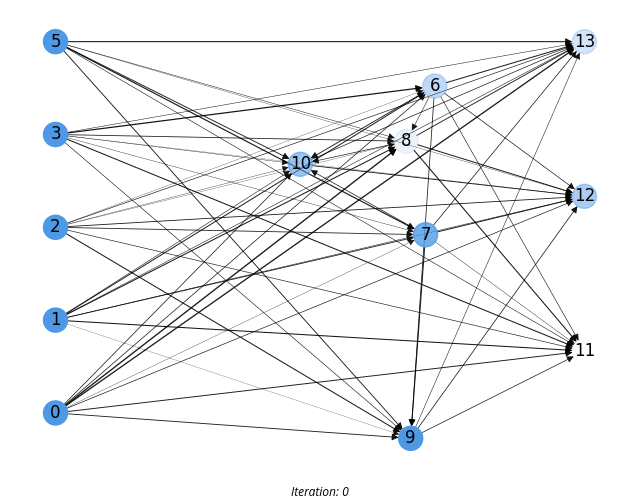

# cjunn

Repository for the paper "Optimizing sparse topologies via Competitive Joint Unstructured Neural Networks"



## Installation

Clone this repository

```
git clone https://github.com/galatolofederico/cjunn.git && cd cjunn
```

Create a virtualenv and install the requirements

```
virtualenv --python=python3.7 env
. ./env/bin/activate
pip install -r requirements.txt
```

## Unit tests

For the unit tests run

```
python -m unittest
```

## Training

To train a model run 

```
python train.py --model <model> --dataset <dataset> (--prune --pruning <level>) (--lottery-ticket --pruning <level>)
```

Available models are `cjunn`, `mlp2`, `mlp3` and `mlp4`. Available datasets are `iris`, `credit`, `transfusion`, `monks`, `tictactoe`, `plates`, `krkp`, `qsar`, `nursery`, `robot` and `seeds`. The pruning level must be between 0 and 1.

To prune a model after train add the flag `--prune` and specify the pruning level with `--pruning <level>`.

To use lottery ticket add the flag `--lottery-ticket` and specify the pruning level with `--pruning <level>`.

For the full arguments list run `python train.py --help`

## Hyperparameter optimization

Set the environment variable `OPTUNA_STORAGE` to your preferred optuna storage (available storages [here](https://docs.sqlalchemy.org/en/14/core/engines.html#sqlalchemy.create_engine))

```
export OPTUNA_STORAGE=sqlite:///optuna.sqlite
```

Install optuna

```
pip install optuna
```

Create study

```
python create_study.py --model <model> --dataset <dataset> (--prune --pruning <level>) (--lottery-ticket --pruning <level>) --study-name <your_study_name>
```

Run trial

```
python run_trial.py --study-name <your_study_name>
```

## Contributions and license

The code is released as Free Software under the [GNU/GPLv3](https://choosealicense.com/licenses/gpl-3.0/) license. Copying, adapting and republishing it is not only allowed but also encouraged. 

For any further question feel free to reach me at  [federico.galatolo@ing.unipi.it](mailto:federico.galatolo@ing.unipi.it) or on Telegram  [@galatolo](https://t.me/galatolo)